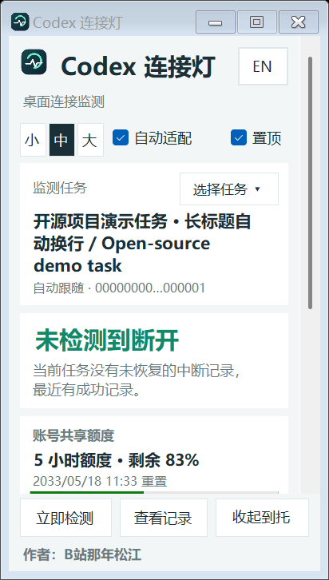
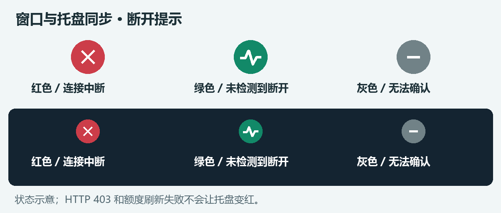

# Codex 连接灯

**桌面上查看 Codex 连接证据、托盘异常状态和账号剩余额度。**

作者：**B站那年松江** · Windows x64 · MIT · [English](README.en.md)

[下载免安装版](https://github.com/whathappenaaa/codex-connection-monitor/releases/latest) · [使用说明](使用说明.md) · [视频与录制材料](docs/video/README.md) · [反馈问题](https://github.com/whathappenaaa/codex-connection-monitor/issues)



*上图来自自动布局测试，任务与额度为虚构样本，不代表你的账号或实时连接。*

## 开始使用

1. 在 Releases 下载 `codex-connection-monitor-v1.4.0-win-x64-portable.zip`，完整解压到可写目录。
2. 双击 `CodexConnectionMonitor.exe`。无需安装 Python、Node.js，也无需输入 API Key。
3. 打开并登录 Codex，在一个任务里产生新的活动。必要时用“选择任务”固定监测对象。
4. 关闭窗口会收起到托盘；双击托盘恢复。彻底退出使用托盘右键菜单。

如果托盘图标被 Windows 折叠，可以将它拖到任务栏常显区。软件不代改系统设置。

## 主要功能

- **任务连接证据**：最近回应、连接错误、重试、本轮结束、证据不足；按任务隔离判断。
- **统一断开提示**：窗口与托盘同步显示，收起后继续监测，颜色与符号辅助辨认。
- **账号额度**：实际返回的额度周期、剩余百分比及本地时间的重置时间；账号共享，不是单任务额度。
- **紧凑窗口**：小／中／大、自适应、置顶、中英切换，作者署名固定显示。
- **独立网络探测**：公共入口和 ChatGPT 入口的响应情况，与任务状态分开解释。



窗口与托盘使用同一个判断，主要只看是否检测到断开：

| 颜色 | 含义 |
| --- | --- |
| 红色 × | 连接中断：Windows 无可用网络、当前任务有未恢复的中断，或 ChatGPT 入口探测发生传输失败；悬停查看具体原因 |
| 绿色脉冲 | 未检测到断开：没有未恢复的任务错误，且有近期成功记录或入口响应 |
| 灰色 — | 无法确认：任务未识别、日志不可读、数据过期，或网络切换后正在重新确认 |

空闲、思考、执行工具和本轮结束不再各占一种状态。任务错误保持红色，直到该任务出现新的成功记录。只有公共入口失败而 ChatGPT 入口仍响应时，不判定 Codex 断开。

**绿色不保证持续在线。红色的入口探测失败也不一定代表模型流已断，具体原因在状态说明里；HTTP 401/403 与额度刷新失败不会让连接灯变红。**

## 更快发现异常

- Windows 网络可用性或地址变化立即触发更新。
- 日志每 0.5 秒检查，网络每 3 秒探测，单次探测限时 2 秒。
- 两个入口各自更新，日志和额度读取不会阻塞网络显示。
- 新错误优先处理，避免大量普通日志造成排队滞后；网络切换前的迟到结果会丢弃。

按调度预算，入口异常通常需要约 0–5.5 秒进入提示，系统负载和网络环境可能增加实际耗时。Codex 对话中断仍取决于它何时写出错误日志；工具无法提前知道，也不会通过发送模型请求来试探连接。没有承诺瞬时或无误报检测。

## 运行要求与验证范围

- 目标系统：Windows 10/11 x64，.NET Framework 4.6 或更新版本及系统 `winsqlite3.dll`。
- 额度功能需要本机已登录的官方 Codex 程序，支持 `account/rateLimits/read`。找不到时可在托盘右键“指定 Codex 程序”。
- 已实测环境：Windows 11 x64（10.0.26200）、Codex CLI 0.158.0-alpha.2.1；1.2 基线曾在 Codex 桌面版 26.924.2738.0 下验证。其他版本及 Windows 10 仍需社区验证。
- 当前发行文件未做商业代码签名，不提供安装器或自动更新。下载后可用 `Get-FileHash` 与 Release 的 `SHA256SUMS.txt` 核对完整性；校验值不替代发行者身份认证。

## 数据来源与隐私

1. **连接与任务名**：只读访问本机 `CODEX_HOME`（默认用户目录的 `.codex`）内的 SQLite 数据，以及 Codex 桌面活动日志。连接日志按固定规则归类，任务名在本机显示。
2. **网络探测**：每 3 秒分别向 `https://www.microsoft.com/favicon.ico`、`https://chatgpt.com/` 发起无账户凭据的 HEAD 请求，单次限时 2 秒。服务端仍会看到正常网络请求信息，例如来源 IP。
3. **额度**：每 60 秒短时启动官方 `codex app-server`，通过本地标准输入输出读取账号状态和额度，由 Codex 管理登录并向官方服务查询。连接灯不读取或保存令牌，不发起模型任务。

没有自建服务器、聊天上传或软件内分析统计；官方 Codex 自身的行为仍受其配置约束。额度只缓存在内存；显示偏好保存为程序目录内 `settings.json`。原始账户响应和辅助进程错误输出不落盘。连接历史只保留最近 30 条分类错误于内存。

桌面活动日志同时检查 `%LOCALAPPDATA%\Codex\Logs` 和 `%LOCALAPPDATA%\Packages\OpenAI.Codex_*\LocalCache\Local\Codex\Logs`。商店版可能只在后者写入真实内容，1.3.1 修复了独立启动时读到普通目录空文件的问题。

有显式代理环境变量时沿用；否则为额度辅助进程转交 Windows 系统代理，**仅影响该子进程**。网络探测与 Codex 的真实请求路径仍可能不同。

## 限制

- 不是 OpenAI 官方产品，不修复网络、TLS、代理或服务端故障。
- 连接判断依赖非稳定的本地日志格式，Codex 升级后可能需要适配。无日志时显示未知。
- 自动跟随采用桌面日志最近的活动任务；多窗口时可手动固定对象。
- 额度是定期获取的快照。刷新失败显示旧数据；到重置时间后重新查询，不擅自补满。
- 系统报告的网络接口可用不保证能访问互联网。探测失败也不能证明整台电脑断网。

## 从源码构建

在 Windows PowerShell 5.1 或 PowerShell 7 中执行：

```powershell
.\scripts\build.ps1
.\scripts\test.ps1
.\scripts\test-transport.ps1
.\scripts\release.ps1
```

默认使用系统 .NET Framework C# 编译器，无第三方 NuGet 依赖。构建产生根目录 EXE（Git 忽略）；测试和发布结果放在 `artifacts`。

单独进行真实 UI 与 18 种布局验收：

```powershell
.\scripts\test.ps1 -IncludeUi
```

`--usage-check <文件>` 仅导出额度窗口与状态，用于自行核对，不含邮箱或账号 ID。`--diagnose <文件>` 可能含任务名称和任务 ID，公开分享前需要自行删改。不要向 Issues 上传原始 Codex 日志、登录文件或聊天记录。

## 开源

[MIT](LICENSE)。使用、修改和分发时保留版权与许可声明。欢迎提交可复现的问题与改进：[贡献指南](CONTRIBUTING.md)。项目由那年松江提出需求并使用 Codex 辅助开发。
